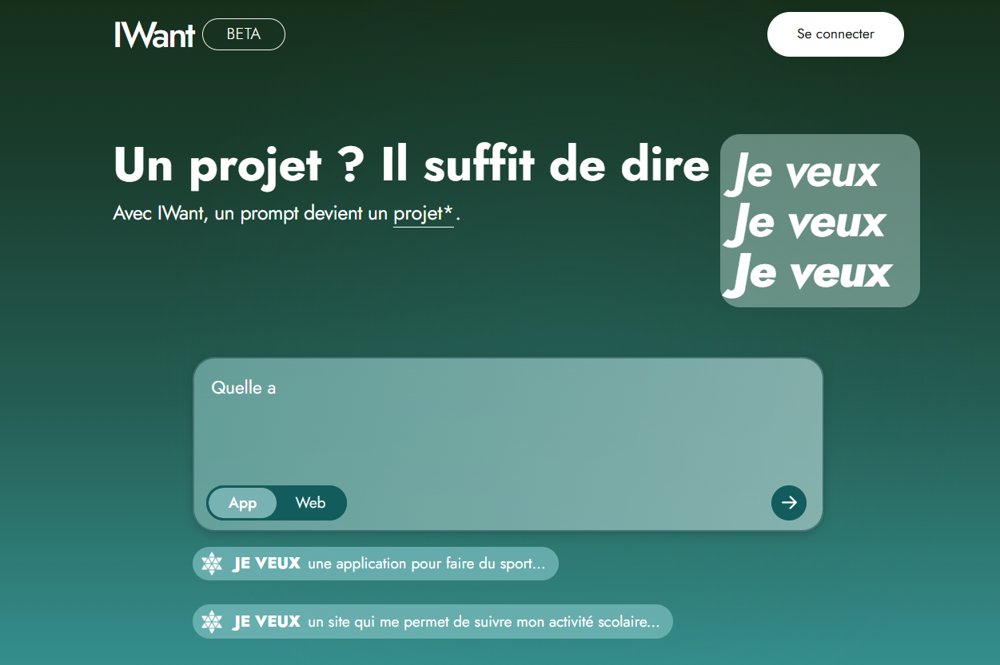
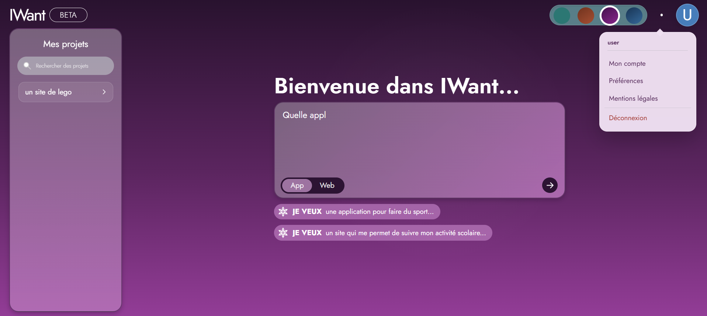
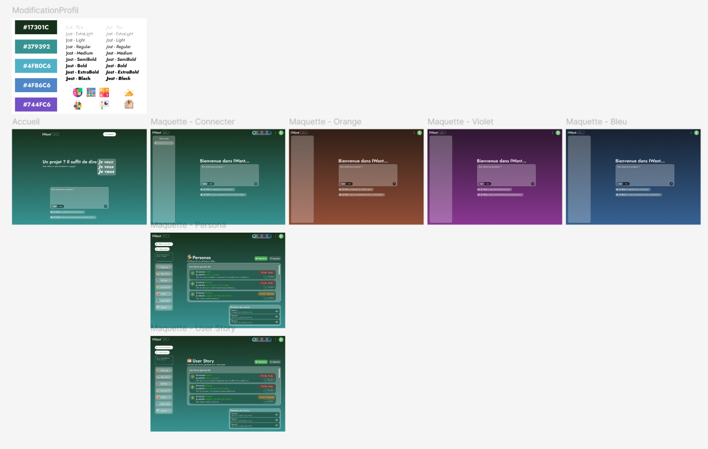
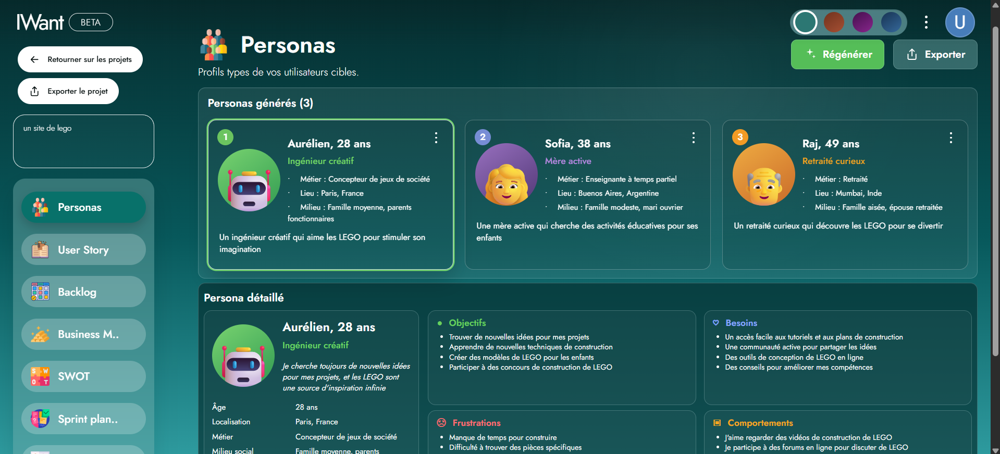
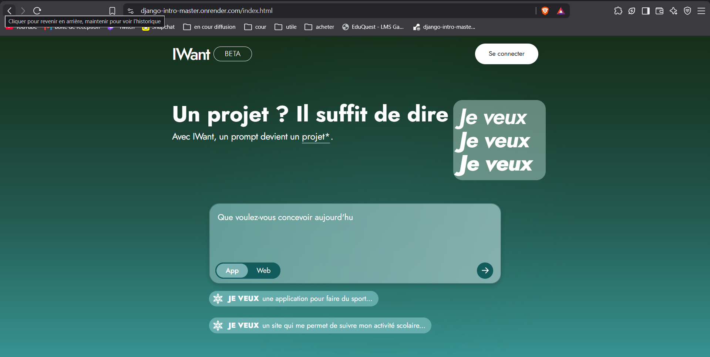
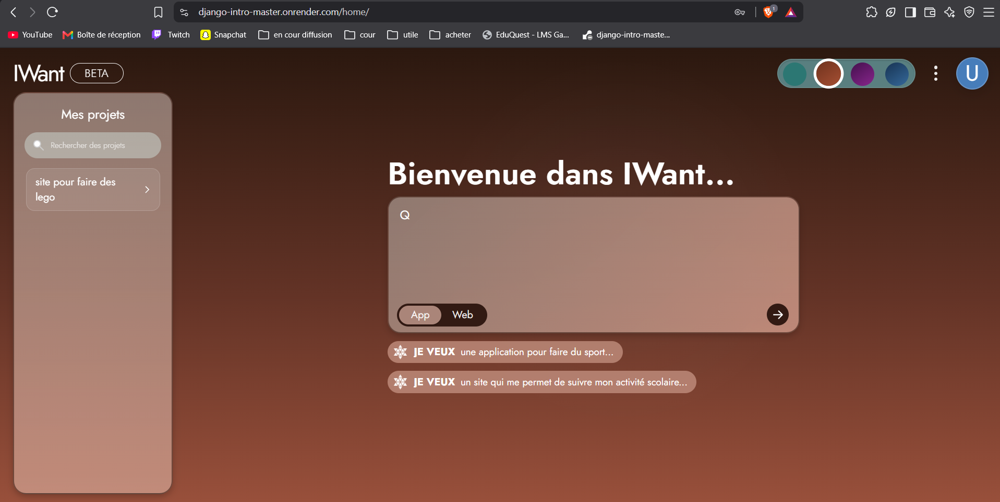
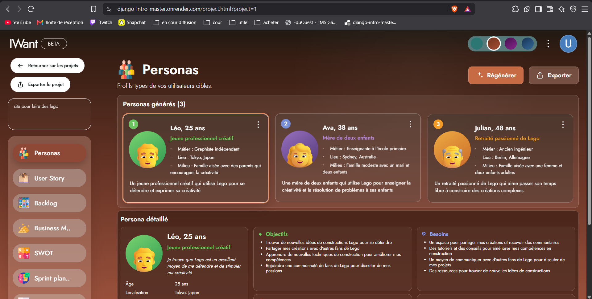

[](https://github.com/RAYWINN43/django-intro-master-IA/actions/workflows/ci.yml)

# IWant - Projet Django IA

**Lien du site hébergé :** [https://django-intro-master.onrender.com/](https://django-intro-master.onrender.com/)

**compte test :** user user1234

## 1. Présentation

**Projet école : plateforme web Django avec génération assistée par IA**

| Élément | Valeur |
| --- | --- |
| Noms et Prénoms | BLAIN Antoine, PECONTAL Corentin, MARTIN Evan |
| Formation | Master |
| Nom du projet | IWant |
| Modèle IA | `llama-3.3-70b-versatile` via Groq |

IWant permet à un utilisateur connecté de décrire une idée de projet.
L'application envoie cette idée à un modèle IA, puis retourne une analyse
structurée : vision du projet, cible, fonctionnalités, contraintes, risques,
indicateurs de réussite et recommandations techniques.

Les prompts et les réponses IA sont enregistrés en base de données et rattachés
au compte qui les a créés. Chaque utilisateur ne voit donc que ses propres
projets dans la rubrique **Mes projets**.

Le projet utilise :

- Django pour le backend, l'authentification, les vues et l'ORM,
- PostgreSQL pour stocker les utilisateurs, profils et analyses IA,
- Groq pour appeler le modèle `llama-3.3-70b-versatile`,
- Redis et Celery pour préparer le traitement asynchrone,
- Docker Compose pour lancer toute l'infrastructure locale,
- Gunicorn et WhiteNoise pour l'exécution en production,
- HTML, CSS et JavaScript pour l'interface utilisateur,
- Black, Ruff et GitHub Actions pour la qualité du code.

## 2. Guide de démarrage rapide

### Prérequis

Avant de lancer le projet, il faut avoir :

- Git,
- Docker Desktop,
- Docker Compose,
- une clé API Groq.

### Configuration

Cloner le projet :

```powershell
git clone https://github.com/RAYWINN43/django-intro-master-IA.git
cd django-intro-master-IA
```

Créer le fichier `.env` à partir du fichier d'exemple :

```powershell
copy .env.example .env
```

Compléter ensuite les variables nécessaires dans `.env`, notamment la clé Groq :

### Lancer le projet

Depuis la racine du projet :

```powershell
docker compose up --build
```

L'application est ensuite accessible ici :

```text
http://127.0.0.1:8001/
```

Pour lancer les tests :

```powershell
docker compose exec web python manage.py test
```

## 3. Architecture technique et pipeline IA

Le projet suit l'architecture MVT de Django. Les modèles gèrent les données, les
vues traitent les requêtes HTTP et les templates du dossier `front` affichent
l'interface.

### Architecture du projet


### Pipeline IA


Le prompt système demande au modèle d'agir comme Product Manager, architecte,
expert UX et conseiller startup. Le modèle doit retourner un objet JSON
structuré contenant la vision, la cible, les fonctionnalités, les contraintes,
les hypothèses, les risques, les indicateurs de réussite et la complexité
technique.

Les paramètres IA principaux sont :

- modèle : ~~`llama-3.3-70b-versatile`~~ fin du support le 16 aout on a du changer en urgence le model par `qwen/qwen3.6-27b`
- température : `0.2` pour obtenir une réponse plus stable,
- limite de sortie : `1600` tokens.

### Modèle ORM


La sécurité de l'historique est contrôlée côté serveur. La page `/home/` charge
uniquement les analyses de l'utilisateur connecté. La route de détail vérifie à
la fois l'identifiant du projet et son propriétaire, un utilisateur ne peut pas
ouvrir le projet d'un autre compte.

## 4. Choix UI/UX et gestion du temps d'inférence

L'interface a été pensée pour rendre l'attente de l'IA compréhensible. Une
génération peut prendre plusieurs secondes, car elle dépend du réseau, de Groq
et de la charge du modèle.

Pendant une génération :

- un message indique que l'idée est envoyée au service IA,
- le bouton d'envoi est désactivé pour éviter les doubles envois,
- les erreurs de configuration, de réseau ou d'API sont affichées dans la page,
- le projet généré apparaît immédiatement dans **Mes projets** après succès,
- l'utilisateur peut rechercher ses anciens projets et les rouvrir,
- l'interface reste responsive sur ordinateur et mobile.

Le projet utilise aussi quatre thèmes visuels, un menu de compte, une page de
profil et une page projet. Les fichiers CSS centralisent les couleurs et les
adaptations responsive.

La génération IA est actuellement synchrone : Django attend la réponse de Groq
avant de renvoyer le résultat au navigateur. Redis et Celery sont déjà présents
dans l'infrastructure pour préparer une évolution vers un traitement en tâche de
fond.

## 5. Rapport d'ingénierie et post-mortem

### Choix techniques

Django a été retenu pour son ORM, son système d'authentification, sa protection
CSRF, ses formulaires et son interface d'administration. PostgreSQL permet de
conserver proprement les utilisateurs, profils et analyses IA. Groq permet
d'utiliser un grand modèle de langage sans héberger de GPU dans le projet.

### Analyse critique du modèle IA

Points forts :

- bonne compréhension des idées formulées en langage naturel,
- production rapide d'une première spécification produit,
- structure JSON demandée dans le prompt système,
- température à `0.2`, ce qui rend les réponses plus régulières.

Limites :

- le modèle peut faire des hypothèses trop générales,
- le JSON retourné peut être invalide malgré les consignes,
- certaines recommandations techniques doivent être relues par un humain,
- la latence varie selon la disponibilité du fournisseur IA.

### Gestion des coûts et quotas API

Chaque création de projet déclenche un appel à Groq. Le coût dépend du nombre de
tokens envoyés et reçus. Pour limiter la consommation, le projet :

- limite la réponse à `1600` tokens,
- n'appelle pas Groq pendant les tests automatisés,
- utilise des mocks dans la suite de tests,

### Difficultés rencontrées

Pendant le développement, plusieurs points ont demandé une attention
particulière :

- comprendre de django (pas familier avec le MVT)
- Compilation docker a chaque modif devoir tout rebuild 
- empêcher un utilisateur d'accéder aux projets d'un autre utilisateur,
- le langchain qui est une decouverte pour nous
- gérer le temps d'attente de l'IA sans bloquer l'utilisateur sans retour visuel.

### Solutions mises en place

Les migrations Django et la commande `seed_users` sont exécutées au démarrage du
conteneur. Les secrets sont placés dans `.env`. Les projets IA sont filtrés par
utilisateur connecté. Les appels IA sont isolés dans un client dédié et les
erreurs sont renvoyées avec des messages compréhensibles.

La suite de tests vérifie notamment l'authentification, les règles de mot de
passe, le profil, l'historique des projets, les endpoints IA et le refus d'accès
au projet d'un autre utilisateur.

## 6. Améliorations à venir

Plusieurs évolutions peuvent encore renforcer le projet :
- pouvoir modifier des element des pages spécialisées du projet : personas, user
  stories, backlog, SWOT, business model, sprint planning et pitch,
- voir les different version du projet générée 
- pour faire un suivie de projet complet
- suivre la consommation de tokens par utilisateur pour mieux contrôler les
  coûts et quotas API,
- ajouter une limite de débit pour éviter trop d'appels IA sur une courte
  période,
- renforcer le monitoring de production avec des logs structurés et un outil de
  suivi d'erreurs,
- améliorer encore l'accessibilité et les retours visuels sur mobile.

## 7. Tests, qualité et CI

Le projet utilise Black et Ruff pour garder un code Python propre :

```powershell
uvx black --check .
uvx ruff check .
```

Les tests Django peuvent être lancés avec :

```powershell
docker compose exec web python manage.py test
```

La CI GitHub Actions vérifie le formatage, le linting, le `check` Django, la collecte des fichiers statiques et les tests. Les appels à l'IA sont simulés, donc la CI ne consomme aucun token Groq.

## 8. Répartition du travail

| Membre | Contribution principale |
| --- | --- |
| Evan MARTIN | UI/UX, maquettes, design system, responsive et interactions front |
| Antoine BLAIN | Authentification, sécurité, Docker, PostgreSQL, Redis, CI/CD et Render |
| Corentin PECONTAL | Backend Django, intégration Groq, modèles ORM, persistance et tests IA |

## 9. Auto-évaluation

### PARTIE 1 : Application Web Django, UI/UX & Intégration IA

Cette première note évalue la qualité de la plateforme web, la robustesse du
backend Django et la valeur ajoutée de l'expérience utilisateur liée à l'IA.

| Partie | Critère | Détail | Note |
| --- | --- | --- | ---: |
| 2.1.1. Architecture Django, ORM & Moteur IA | Intégration du Moteur IA | Pipeline Groq fonctionnel pour les personas, user stories, backlog, SWOT, Business Model Canvas, speech et Sprint 1. Les réponses sont demandées en JSON, normalisées côté Django, mises en cache et régénérables avec un contexte différent. | **2,5 / 3** |
| 2.1.1. Architecture Django, ORM & Moteur IA | Modélisation ORM & Storage | Modèles `User`, `Profile` et `GroqAnalysis`, persistance du prompt initial, des réponses texte/JSON et des sections générées. Il manque encore des modèles séparés de type `History`, `Result` ou stockage média dédié. | **2,5 / 3** |
| 2.1.1. Architecture Django, ORM & Moteur IA | Architecture Asynchrone / SRP | Générateurs IA séparés dans `ai/services`, prompts isolés dans `ai/prompts` et vues Django centrées sur l'orchestration. Redis/Celery sont présents, mais les appels Groq des pages restent encore synchrones côté requête HTTP. | **1,5 / 2** |
| 2.1.2. Ergonomie UI/UX & Retours d'État IA | Design System & Tokens | Interface cohérente avec thèmes, variables CSS, navigation projet, avatar dynamique, menu compte, pages spécialisées et mise en page responsive. | **2 / 2** |
| 2.1.2. Ergonomie UI/UX & Retours d'État IA | Gestion des Latences IA | Les pages IA affichent un état de génération, désactivent les boutons pendant l'appel et évitent d'afficher les anciennes valeurs en dur au premier chargement. Il n'y a pas encore de streaming ni de skeleton avancé. | **1,5 / 2** |
| 2.1.2. Ergonomie UI/UX & Retours d'État IA | Gestion des Erreurs & Quotas | Les erreurs JSON, session expirée, projet introuvable, configuration Groq et quota/réseau sont renvoyées à l'utilisateur avec des messages visibles. | **2 / 2** |
| 2.1.3. Valeur Métier & Originalité du Projet | Utilité & Pertinence du Cas | L'application répond à un cas d'usage clair : transformer une idée de projet en livrables produit exploitables pour cadrer rapidement une application. | **3 / 3** |
| 2.1.3. Valeur Métier & Originalité du Projet | Qualité du Prompt / Modèle | Prompts `.md` spécialisés par livrable, contraintes strictes de JSON, diversité à la régénération et prise en compte du prompt initial. LangChain/LangGraph reste une amélioration prévue. | **2,5 / 3** |
| **Total partie 1** |  |  | **17,5 / 20** |

### PARTIE 2 : Cloud, Infrastructure, DevOps & Documentation

Cette seconde note évalue la mise en production, la conteneurisation Docker, la
sécurité des secrets, la qualité de code et la documentation.

| Partie | Critère | Détail | Note |
| --- | --- | --- | ---: |
| 2.2.1. Déploiement Cloud & Production | URL de Production Live | URL Render indiquée dans le README avec accès HTTPS. | **4 / 4** |
| 2.2.1. Déploiement Cloud & Production | Gestion des Secrets & SecOps | Secrets sortis du code, configuration par variables d'environnement et `.env.example` fourni. | **3 / 3** |
| 2.2.2. Conteneurisation Docker & Infrastructure | Dockerfile de Prod | Image Python Alpine, installation via `uv`, collecte des statiques, entrypoint et utilisateur non-root. | **2,5 / 2,5** |
| 2.2.2. Conteneurisation Docker & Infrastructure | Orchestration Compose | `docker-compose.yml` multi-services avec web, PostgreSQL, Redis, worker Celery, volumes et healthchecks. | **2,5 / 2,5** |
| 2.2.3. Tests, CI/CD & Qualité de Code | Tests Automatisés & Mocks | Tests Django sur l'authentification, les projets, les endpoints IA et mocks pour éviter les appels Groq réels. | **2 / 2** |
| 2.2.3. Tests, CI/CD & Qualité de Code | CI/CD & Linting | GitHub Actions, Black, Ruff, `manage.py check`, collectstatic et tests automatisés. | **2 / 2** |
| 2.2.4. Rapport Technique README.md & Post-Mortem | Présentation & Noms | README avec noms et prénoms, lien d'hébergement, guide local Docker et configuration `.env.example`. | **2 / 2** |
| 2.2.4. Rapport Technique README.md & Post-Mortem | Architecture & Post-Mortem | Diagrammes PlantUML, architecture, pipeline IA, modèle ORM, analyse critique, coûts et difficultés rencontrées. | **2 / 2** |
| **Total partie 2** |  |  | **20 / 20** |

### Capture d'écran de l'interface 
Home page : 

maquette Figma : 
lien de la maquette : https://www.figma.com/design/nb8sZ0HtAib1RrgGGWqXq7/Messagerie--Copy-?node-id=18-79&p=f&t=DBORX0MkIUz2fPnJ-0  
interface personas : 
Home page render : 

interface personas : 
